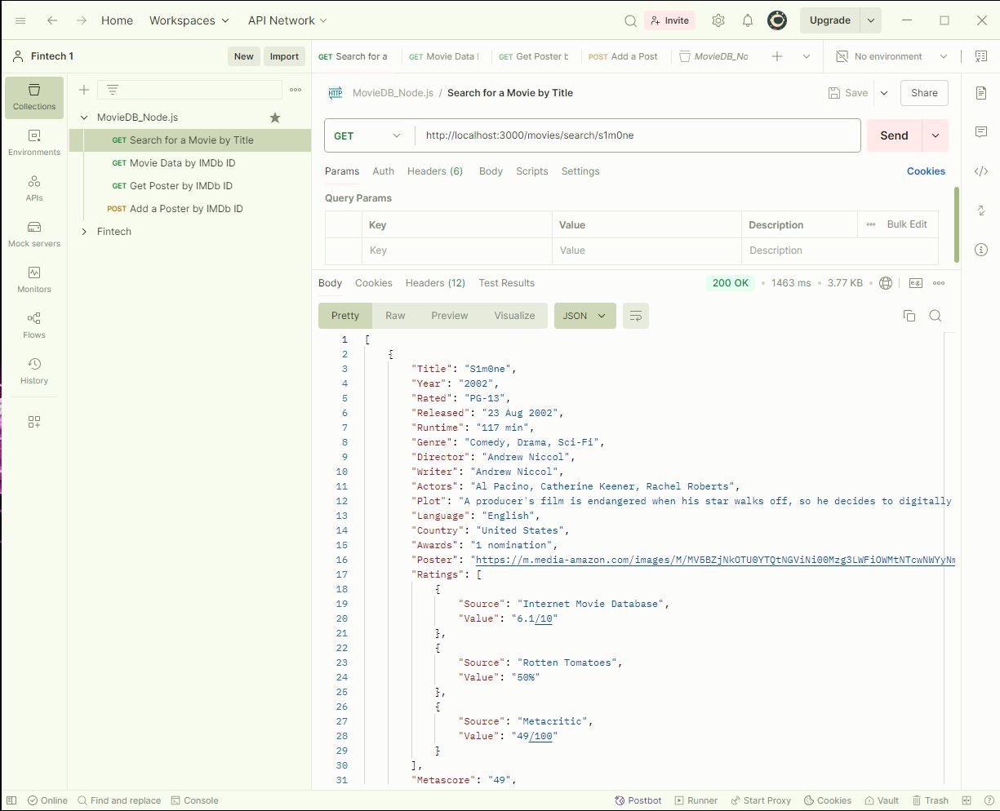

# Movie Streaming API

A Node.js API that provides movie information and poster management using the Streaming Availability API. This implementation uses native Node.js modules without using Express.js.

**This README.md provides:**
- Clear installation instructions
- Detailed endpoint documentation
- Testing procedures with Postman
- Project structure overview
- Security features
- Contributing guidelines
- Example Requests in Postman
- API Error Testing Examples
- Project Structure
- License

---
## Prerequisites

- Node.js (v12 or higher)
- npm (Node Package Manager) 
- A [`Streaming Availability API key`](https://rapidapi.com/movie-of-the-night-movie-of-the-night-default/api/streaming-availability) from `RapidAPI`
- A [`free OMDb API key`](https://www.omdbapi.com/apikey.aspx?__EVENTTARGET=freeAcct&__EVENTARGUMENT=&__LASTFOCUS=&__VIEWSTATE=%2FwEPDwUKLTIwNDY4MTIzNQ9kFgYCAQ9kFggCAQ8QDxYCHgdDaGVja2VkZ2RkZGQCAw8QDxYCHwBoZGRkZAIFDxYCHgdWaXNpYmxlZ2QCBw8WAh8BaGQCAg8WAh8BaGQCAw8WAh8BaGQYAQUeX19Db250cm9sc1JlcXVpcmVQb3N0QmFja0tleV9fFgMFC3BhdHJlb25BY2N0BQhmcmVlQWNjdAUIZnJlZUFjY3TuO0RQYnwPluQ%2Bi0YJHNTcgo%2BfiAFuPZl7i5U8dCGtzA%3D%3D&__VIEWSTATEGENERATOR=5E550F58&__EVENTVALIDATION=%2FwEdAAV39P5KqwNGJgd%2F4UbyWCx3mSzhXfnlWWVdWIamVouVTzfZJuQDpLVS6HZFWq5fYpioiDjxFjSdCQfbG0SWduXFd8BcWGH1ot0k0SO7CfuulNNHYC5f864PBfygTYVt5wnDXNKUzugcOMyH4eryeeGG&at=freeAcct&Email=) from `OMDb API` [Documentation Here](https://docs.movieofthenight.com/)
- Postman (for testing endpoints)

## Installation

1. Clone the repository:
   ```bash
   git clone https://github.com/Ebad-S/Movie_Streaming_API.git
   ```

2. Install dependencies:
   ```bash
   npm install
   ```

3. Create a `.env` file in the root directory with the following content:
   ```env
   OMDB_API_KEY=your_omdb_key
   STREAMING_API_KEY=your_rapidapi_key
   STREAMING_API_HOST=streaming-availability.p.rapidapi.com
   PORT=3000
   ```

## Starting the Server

Run the following command to start the server:

```bash
node server.js
```

The server will start on `http://localhost:3000` (or the 
PORT specified in your .env file)

## API Endpoints

### 1. Search for a Movie by Title
- **Method:** GET
- **URL:** `http://localhost:3000/movies/search/{movietitle}`
- **Example:** `http://localhost:3000/movies/search/inception`
- **Response:** JSON object containing movie search results


### 2. Get Movie Data by IMDb ID
- **Method:** GET
- **URL:** `http://localhost:3000/movies/data/{IMDB_ID}`
- **Example:** `http://localhost:3000/movies/data/tt1375666`
- **Response:** JSON object containing detailed movie information


### 3. Get Poster by IMDb ID
- **Method:** GET
- **URL:** `http://localhost:3000/posters/{IMDB_ID}`
- **Example:** `http://localhost:3000/posters/tt1375666`
- **Response:** JPEG image file
- **Note:** Returns locally stored poster if available,otherwise fetches from API


### 4. Add a Poster by IMDb ID
- **Method:** POST
- **URL:** `http://localhost:3000/posters/add/{IMDB_ID}`
- **Example:** `http://localhost:3000/posters/add/tt1375666`
- **Body:** Form-data with image file
- **Response:** JSON confirmation message
- Uploaded image will be saved in `posters/` directory with the IMDb ID as the filename.


## Testing with Postman

1. **Search Movies:**
   - Create a GET request to `http://localhost:3000/movies/search/inception`
   - No additional headers required

2. **Get Movie Data:**
   - Create a GET request to `http://localhost:3000/movies/data/tt1375666`
   - No additional headers required

3. **Get Poster:**
   - Create a GET request to `http://localhost:3000/posters/tt1375666`
   - Response will be an image file

4. **Upload Poster:**
   - Create a POST request to `http://localhost:3000/posters/add/tt1375666`
   - In Postman, go to the "Body" tab
   - Select "form-data"
   - Add your image file
   - Send the request

## Error Handling

The API includes error handling for:
- Invalid endpoints (404)
- Server errors (500)
- Missing image files
- API communication errors

## Project Structure

project-root/

├── server.js # Main server file

├── movieService.js # Movie API service functions

├── .env # Environment variables

├── posters/ # Directory for stored posters

└── README.md # Documentation


## Security Features

- CORS enabled for cross-origin requests
- Environment variables for sensitive data
- Input validation and sanitization
- Error handling and logging

## Contributing

1. Fork the repository
2. Create your feature branch (`git checkout -b feature/AmazingFeature`)
3. Commit your changes (`git commit -m 'Add some AmazingFeature'`)
4. Push to the branch (`git push origin feature/AmazingFeature`)
5. Open a Pull Request

## License

This project is licensed under the MIT License - see the LICENSE file for details

---

# API Error Testing Examples

## 1. Search Movies Endpoint (`/movies/search/{title}`)

Test 400 - No Title Provided:
```
GET http://localhost:3000/movies/search/
GET http://localhost:3000/movies/search/%20
```
Expected Response:
```json
{
  "error": true,
  "message": "You must supply a title!"
}
```

Test 500 - API Error:
```
GET http://localhost:3000/movies/search/asdfjkl12345notamovie
```
Expected Response:
```json
{
  "error": true,
  "message": "The remote detail server returned an invalid response"
}
```

## 2. Movie Data Endpoint (`/movies/data/{imdbId}`)

Test 400 - No IMDB ID:
```
GET http://localhost:3000/movies/data/
```
Expected Response:
```json
{
  "error": true,
  "message": "You must supply an imdbID!"
}
```

Test 400 - Invalid IMDB ID Format:
```
GET http://localhost:3000/movies/data/12345
GET http://localhost:3000/movies/data/xx1234567
```
Expected Response:
```json
{
  "error": true,
  "message": "Invalid IMDb ID format. Must start with \"tt\""
}
```

Test 403 - Incorrect IMDB ID:
```
GET http://localhost:3000/movies/data/tt0000000
```
Expected Response:
```json
{
  "error": true,
  "message": "Incorrect IMDb ID."
}
```

## 3. Get Poster Endpoint (`/posters/{imdbId}`)

Test 400 - No IMDB ID:
```
GET http://localhost:3000/posters/
```
Expected Response:
```json
{
  "error": true,
  "message": "You must supply an imdbID!"
}
```

Test 500 - Image Not Found:
```
GET http://localhost:3000/posters/tt9999999
```
Expected Response:
```json
{
  "error": true,
  "message": "The image could not be found or could not be read"
}
```

## 4. Add Poster Endpoint (`/posters/add/{imdbId}`)

Test 400 - No IMDB ID:
```
POST http://localhost:3000/posters/add/
```
Expected Response:
```json
{
  "error": true,
  "message": "You must supply an imdbID!"
}
```

Test 400 - Wrong File Type:
```
POST http://localhost:3000/posters/add/tt1375666
Content-Type: image/png
```
Expected Response:
```json
{
  "error": true,
  "message": "Only JPG images are supported"
}
```

Test 400 - No File Provided:
```
POST http://localhost:3000/posters/add/tt1375666
Content-Type: multipart/form-data
```
Expected Response:
```json
{
  "error": true,
  "message": "No image file found in request"
}
```

Test 400 - Invalid Movie ID:
```
POST http://localhost:3000/posters/add/tt9999999
Content-Type: multipart/form-data
[Include JPG file]
```
Expected Response:
```json
{
  "error": true,
  "message": "Incorrect IMDb ID."
}
```

## Author
Ebad Salehi 
